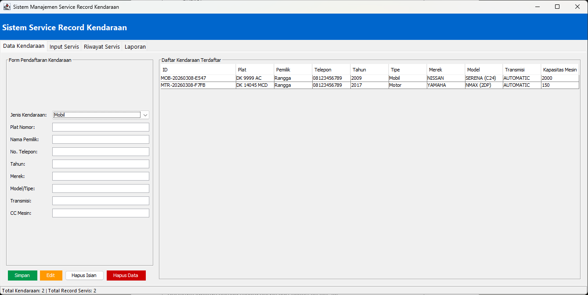

# Program Service Record Kendaraan



Program berbasis Java untuk mengelola data service record kendaraan bermotor (Mobil & Motor).
Dibuat untuk memenuhi syarat sertifikasi LSP.

## Teknologi
- **Bahasa**: Java
- **IDE**: NetBeans
- **GUI**: Java Swing
- **Database**: SQLite
- **Library Eksternal**: sqlite-jdbc-3.45.3.0

## Fitur
- Login dengan autentikasi username & password
- Pendaftaran kendaraan (Mobil & Motor) — CRUD
- Pencatatan record servis kendaraan
- Riwayat servis per kendaraan dengan fitur pencarian
- Update status servis (Menunggu / Dalam Proses / Selesai)
- Generate & export laporan ke file .txt

## Struktur Package
```
com.servicerecord.model   → Entity class (Vehicle, Car, Motorcycle, ServiceRecord)
com.servicerecord.db      → Database access (VehicleDB, ServiceRecordDB)
com.servicerecord.service → Business logic (ServiceRecordManager)
com.servicerecord.ui      → GUI (MainApp, Mainframe, LoginFrame, dll)
com.servicerecord.util    → Utility (DatabaseManager, IDGenerator, Printable)
```

## Cara Instalasi
1. Clone repository ini
2. Buka dengan Apache NetBeans
3. Tambahkan `sqlite-jdbc-3.45.3.0.jar` ke Libraries (klik kanan Libraries > Add JAR/Folder)
4. Set Main Class: `com.servicerecord.ui.MainApp`
5. Run

## Akun Default
| Username | Password | 
|----------|----------|
| admin    | 123 |
| 123  | 123 |
| secretadmin  | 666 |
